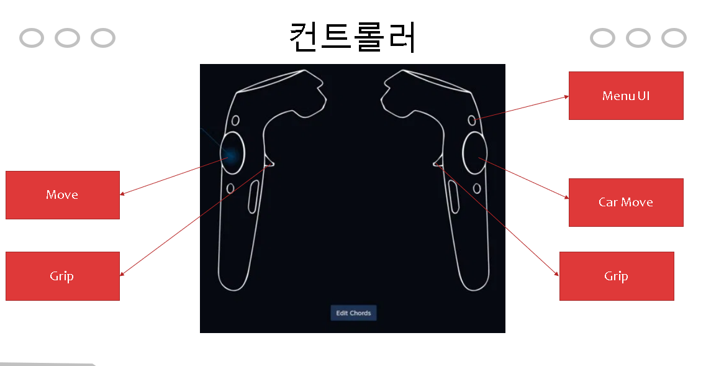

# [컨셉]
## 메인컨셉 : 어드벤처(Advanture)
- 세계전쟁으로 인한 멸망이 진행된 맵을 보며, 전쟁이 얼마나 잔혹한지를 겪게 해주는 어드벤처 게임으로, VR로 구현할 예정

### 서브컨셉 1 : 아포칼립스
- 계속되는 눈보라와 주변 지형 등을 통해 아포칼립스적 분위기를 눈치챌 수 있게 합니다.
    
### 서브컨셉 2 : 로드무비
- 플레이어가 만들어진 길에 따라 퀘스트가 진행되는 연출을 사용할 예정입니다.
    
### 서브컨셉 3 : 그래픽
- 만지기만 해도 얼어붙을 거 같은 지형들과 주변 환경 등을 통해 환경에 대한 사실적 요소를 추가 할 예정입니다.
    
### 서브컨셉 4 : 퍼즐
- 플레이어에 반응하는 NPC 등을 통해 앞으로 살아나가야 하는데 필요한 물품 등을 구할 수 있는 퍼즐을 넣을 예정입니다..
  
# [관련이미지 & 동영상]
- 이미지

- 동영상
> VR 컨트롤러 관련 참고 영상

> VR 내부시스템 및 서브컨텐츠 참고 영상

  
# [대표 이미지]

  
# [컨셉 & 대표이미지 기반 작품묘사]
### 대표이미지 기반 : 
> 플레이어의 주변의 시야에 제한을 두어 공포적이고 차가운 연출을 사용하며, 흐릿하게 보이는 길을 따라 로드무비를 진행하는 모습입니다.

### 컨셉 기반 : 
> 제한된 시야지만 길을 따라 퀘스트 등을 해결하면서 생존해가며 어딘가 끝이 있을 최상층을 항해 나아갑니다.

  
# [라스트 어드벤처 구성 요소]

## 1. 메커니즘   
> [도전 과제]
1. 불편하고 기괴하지만 계속해서 나아가게 만드는 기이한 게임!
2. 어둡고 충격적이지만 무시무시하게 아름다운 환경이 보인다!
3. 이러한 세상의 비밀을 알아가라!

> [재미 요소]
1. 불편한 시스템이 오히려 공포심을 자극시켜 마치 공포스러운 분위기의 맵을 탐험하는 듯한 표현을 줍니다.
2. 맵에 대한 시선을 좁히면서 무엇이 나올지 모르는 환경을 조성하지만 맵이 잘 보이는 구간은 아름답게 연출하여 극적인 묘사를 보여줍니다.
3. 특수한 사정이 있는 듯 한 맵의 분위기로 유저가 현재 세계에 대한 궁금증을 자극시킵니다.

## 2. 이야기
> 오래 전 벌어진 세계 대전급의 전쟁으로 인해 남은 것은 폐허가 된 도시와 무기들밖에 없는 세상에서 주인공은 잠에서 깨어난다.
> 주인공이 개조한 차를 타고 다니며 오늘도 살아남기 위한 여행을 시작한다.
> 그러던 어느날 타고있던 차의 기름이 다 떨어져 나갈때 쯤 한 남자를 만나게 되는데...

> [만들게 된 배경] 
##### 전쟁 등으로 멸망한 세계에 대한 모험심 등을 자극시키는 VR로 이루어진 어드벤처 게임을 만들어 보는 것이 좋다 생각하여 만들게 되었습니다.

> [카메라 관점]
##### 직접 생존하는 듯한 느낌을 들게 하기 위하여 1인칭 시점을 사용한 카메라를 이용할 예정입니다. VR 시스템의 내부적으로 지원하는 카메라로 구성할 예정입니다.

## 3. 미적요소
> 1. 주변이 어둡고 주로 눈이 쌓여 있는 모습을 주어 멸망적 느낌을 줄 예정입니다.
> 2. 대부분 어두운 컬러(회색 등)을 이용하여 차가운 연출을 할 예정입니다.
> 3. 눈보라가 몰아치고 어딘가 부서지는 듯한 음성 등을 넣어 폐허가 된 환경에 대한 이해를 도울 예정입니다.

  
# 게임시스템디자인

## 1. 게임 오브젝트 분해
|연번|오브젝트 이름|오브젝트 이미지|
|:---:|:---: |:---:|
|1|플레이어|./img/플레이어손.png|
|2|퀘스트NPC|./img/NPC.png|
|3|도구ㅡ이동수단|./img/차.png|
|4|도구ㅡ연료|./img/연로.png|
|5|도구ㅡ식량|./img/식량.png|
|6|맵ㅡ첫번째 맵(Man)|./img/맵1.png|
|7|맵ㅡ두번째 맵(파이프)|./img/맵2.png|
|8|맵ㅡ세번째 맵(Tower)|./img/맵3.png|

## 2. 파라미터(속성)

## 3. 행동

## 4. 상태

## 5. 플레이어 캐릭터 속성(파라미터)

## 6. 게임의 규칙

## 7. 게임에서 사용될 
